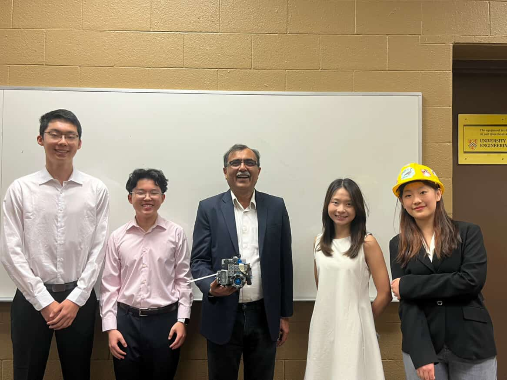

# CardIn: Automated Card Dealing Robot

An automated card dealing robot designed to smoothly and accurately distribute playing cards to multiple players. Originally created as a Mechatronics Engineering project at the University of Waterloo, **CardIn** acts as an impartial robotic dealer to enhance game nights by providing hands-free, reliable, and repeatable card distribution.

<a href="projectInfo/Robot%20Project%20Report.docx" download>
  <button style="padding: 10px 20px; font-size: 16px; cursor: pointer; border-radius: 5px; background-color: #007BFF; color: white; border: none;">
    📖 Read More / Download Project Report
  </button>
</a>

## 👥 Contributors
*Tian Ma, Ruby Gao, Ho Yan Lam, Eric Zhang*

---

## 🚀 Features

- **Automated Card Distribution:** Can distribute a chosen number of cards to up to 7 players.
- **Two Dealing Methods:** 
  - *Location-based:* Drives to set coordinates to deal cards directly to each player via an odometry system.
  - *Radial dealing:* Distributes cards while spinning in a circle from a central position.
- **Odometry & Navigation:** Custom programmed odometry using motor encoders and the VEX IQ inertial sensor for precise position tracking and smooth movement.
- **Collision Detection:** A tension-assisted bumper mechanism evenly detects collisions across the robot's front to prevent accidental trajectory disruptions.
- **Card Sensing:** Interfaced with a colour sensor to dynamically detect the presence of remaining cards in the chute.

## 🛠 Hardware and Mechanical Design

The mechanical chassis was developed with a focus on speed, ease of use, and compact design constraints:
* **Drivetrain:** A 3-wheel configuration utilizing two powered wheels and one perpendicular omni-wheel, allowing precise turning and translation across the playing surface.
* **Card Ejection Mechanism:** Composed of a friction roller, a custom card holder, a front plate, and weights. This allows for controlled, single-card ejection using motor encoders to manage the ejection speed.
* **Custom 3D Printing:** Various components, including the card holding chute, ramps, and weighting mechanisms, were 3D-printed alongside standard VEX IQ V2 parts to keep the profile compact.

## 💻 Software Design

The software architecture is written primarily in C++ using the VEX IQ framework and utilizes object-oriented principles to handle the robot's states.
* **Movement Class:** Handles closed-loop odometry calculations (`smooth()`, `findTangent()`, `locationUpdate()`, `moveTo()`) to translate motor encoder counts and gyro headings into X/Y coordinates.
* **Safety & Shutdown:** A structured setup and ending procedure allows manual overrides through VEX IQ controller buttons and touch sensors.

## 🎯 Challenges & Prototyping
* **Gearing vs Precision:** Prototyped a 6-gear drivetrain to maximize ejection speed, but reverted to direct/simplified ratios due to motor strain and the realization that excess speed reduced dealing accuracy.
* **Bumper Edge Detection:** Added a complex network of tensioned strings to the front bumper plate so soft collisions on the far edges would still be accurately detected by the central bumper switch.
* **Single Card Ejection:** Engineered adjustable weights and 3D printed angled ramps over multiple iterations to ensure only one card ejected at a time, overcoming early jams and misfires. 
